# OMTP

This repository is part of the Object Manipulation and Task Planning course, from the 8th semester, Msc. in Robotics 2022.
The repository contains the solutions to the assignments given in the course. Each lecture has their own section in the README and each exercise has a tag like lec<number>_submission. In each lecture section the solution to the assignment in the specific lecture is detailed further. Installation of necessary packages, usage of the code and error handling is elaborated on in the lecture sections.
## Prerequisites:
### ROS and Gazebo installation
The project has been tested using the following versions.
* Ubuntu 20.04 and [ROS Noetic](https://wiki.ros.org/noetic/Installation) & [Gazebo](http://gazebosim.org/tutorials/?tut=ros_wrapper_versions) 11 

## Lecture 1- Building a Robot Simulation Environment in ROS
Task list for Lecture 1:
1) Follow two URDF tutorials
2) Follow one XACRO tutorial
3) Inspect the OMTP factory world (AAU Smart Lab)
4) Rebuild the OMTP factory world

The following tutorials about URDF en Xacro files can be used to learn the basics:

* [Building a Visual Robot Model with URDF from Scratch](http://wiki.ros.org/urdf/Tutorials/Building%20a%20Visual%20Robot%20Model%20with%20URDF%20from%20Scratch) 
* [Building a Movable Robot Model with URDF](http://wiki.ros.org/urdf/Tutorials/Building%20a%20Movable%20Robot%20Model%20with%20URDF)
* [Using Xacro to Clean Up a URDF File](http://wiki.ros.org/urdf/Tutorials/Using%20Xacro%20to%20Clean%20Up%20a%20URDF%20File)

### To get started:
1) Create a catkin workspace.(http://wiki.ros.org/catkin/Tutorials/create_a_workspace)
2) Clone the repository:`git clone https://github.com/ROB8-very-N0ICE/OMTP.git` in `$ cd ~/catkin_ws/src`
3) `$ catkin_make` in `$ cd ~/catkin_ws`
4)  The following packages will need to be installed: 
  - http://wiki.ros.org/ros_controllers
  - http://wiki.ros.org/gazebo_ros_pkgs
  - http://wiki.ros.org/gazebo_plugins 
  - http://wiki.ros.org/joint_state_publisher
  - http://wiki.ros.org/joint_state_publisher_gui
  - http://wiki.ros.org/robot_state_publisher 
5) `$ source devel/setup.bash`
6) Visualize factory in Rviz:`$ roslaunch omtp_support visualize_omtp_factory.launch`


<p class="aligncenter">
    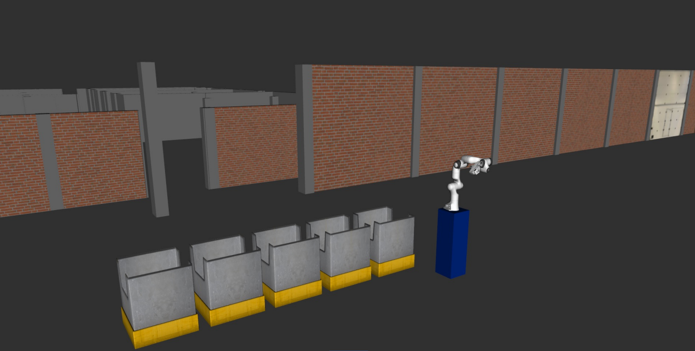
</p>

### Inspecting the factory
1) We transform the xacro factory file into a urdf file: `$ xacro omtp_factory.xacro > omtp.urdf`
2) Check the syntax of the urdf file: `$ check_urdf omtp.urdf`
3) Check the link graph by generating a pdf using: `$ urdf_to_graphiz`


### Rebuild the OMTP factory world
It should include:
* Two Franka robots, one bin per robot can be found here: [file](/franka_description)
* AAU smart lab Festo modules can be found here: [file](/aau_lab_ros_models)
* Additional models/objects( Conveyors, boxes, pallets, shelves etc.) models can be found in te following links:
  * https://app.ignitionrobotics.org/fuel/models
  * https://github.com/osrf/gazebo_models
  * http://data.nvision2.eecs.yorku.ca/3DGEMS/


 
Rebuilding the OMTP factory is accomplished by editing the XACRO file of the factory. The second robot arm is added similar to first one, the bins and ballet are added as modules in the XACRO file. 
#### The OMTP factory xacro file which is modified is:
  ```` .../omtp course files lecture 1 2022/omtp_support/urdf/omtp_factory.xacro. ````

#### 1) Adding the robots to the factory
- Robot descriptions (URDF/XACRO) can be found on [ROS-industrial](http://wiki.ros.org/Industrial/supported_hardware) 

The two robot arms added were the panda manipulators, which can be found from line 41 to 519 for the first panda arm, and the second panda arm being from line 520 to 992, where the eight links are described with a cylinder length, radius, and origin for the two end points. Along with the links, the joints are also described. They contain information about the individual joints rotation position and which links they are connected to, as well as their velocity limit and damping. The links and joints for the end effectors were also added for the two panda arms. Two for each arm.

#### 2) Adding AAU Smart Lab modules
Seven modules were  added and connected to one another in line 1057 to 1225, describing the specific model, their origin point, and which module they are connected to. The modules consists of five modules with a conveyor belt going straight forward, one in a T shape, and the last one containing a closed off workstation.

#### 3) Adding additional objects

 Additionally, a wooden pellet and a nurse were added in front of the factory at line 1236 to line 1282, containing an origin, model and inertia. 


### Running the factory
* From  `~/catkin-ws` launch `$ roslaunch omtp_support visualize_omtp_factory.launch`
* If it is not working remember to source the workspace `source devel/setup.bash`
* After the changes have been added we end up with this:

<p class="aligncenter">
    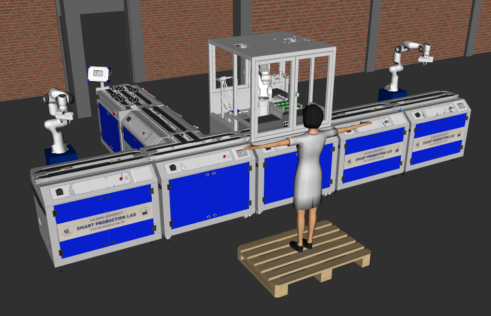
</p>


## Lecture 2: Manipulation with MoveIt
Task list for lecture 2:
1. Create a MoveIt configuration package of your OMTP environment
2. Test moveit_config package with MoveIt Commander command line tool
3. Create a custom OMTP Gazebo launch file and .world
4. Create a pick and place pipeline in Python

### Create a MoveIt configuration package of your OMTP environment
In lecture 2 we created a ROS package using MoveIt setup assistant. By running:
```
rosrun moveit_setup_assistant moveit_setup_assistant 
```
<p class="aligncenter">
    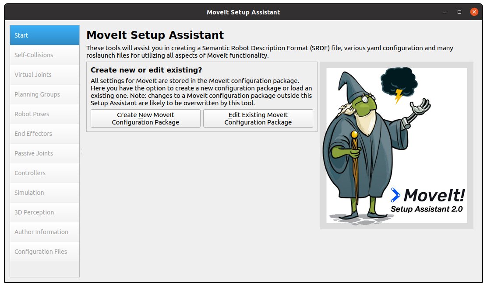
</p>

Here we selected the "Create New MoveIt Configuration Package" and proceeded by filling the required fields,
until "Simulation". Then we generated the URDF script and copied it to the ```/urdf/omtp_factory.xacro``` so that the
robot can be represented in Gazebo.

<p class="aligncenter">
    
</p>

After building the configuration package, we ran ```roslaunch omtp_factory_moveit demo_gazebo.launch```, but
because the URDF file was incomplete, the controllers failed to load and the robot could not move. Therefor we added 
the missing collision and inertial fields to the finger joints.  

```
    <collision>
      <origin xyz="0 0 0.475"/>
      <geometry>
        <box size="0.3 0.3 0.95"/>
      </geometry>
    </collision>
    <inertial>
      <mass value=".1"/>
      <origin rpy="0 0 0" xyz="0 0 0"/>
      <inertia ixx="0.001" ixy="0" ixz="0" iyy="0.001" iyz="0" izz="0.001"/>
    </inertial>
```

Later the robots were in an impossible position so the planner could not find an initial position to start planning the
movement, so we had to add some arm joints that were in collision. This was done by including the colliding joints to 
```src/factory_moveit_config/config/omtp.srdf```.\

To visualize the factory, one can run the command ```roslaunch  ```

### Test moveit_config package with MoveIt Commander command line tool
During the setup assistant, we defined 4 move groups with their respective poses as defined in the list below. 

- arm1
  - arm1_ready
  - arm1_pick
- arm2
  - arm2_ready
  - arm2_pick
- hand1
  - hand1_open
  - hand1_close
- hand2
  - hand2_open
  - hand2_close

To move the robot, we typed in the command line, for example:

```
$ roslaunch omtp_moveit_config demo.launch
$ rosrun moveit_commander moveit_commander_cmdline.py
> use arm1
arm1> go arm1_ready
arm1> go arm1_pick
> use arm2
arm2> go arm2_ready
arm2> go arm2_pick
> use hand1
hand1> go hand1_open
hand1> go hand1_close
```

This can also be applied by using RVIZ.

### Create a custom OMTP Gazebo launch file and .world
To create the launch file we took inspiration from the `demo_gazebo.launch` and used the command
`$(find <PACKAGE>)/` to find files in the other packages. We also change the **box_world.world** to spawn a box object
togethers with our factory.

### Create a pick and place pipeline in Python
The Python script was made in `lecture5_pick_and_place.py` as a normal ROS node. Here the libraries **moveit_commander**
and **moveit_msgs.msg** were used to send commands to the robot. in this fashion

``` 
move_group = moveit_commander.MoveGroupCommander(group_name)
planning_frame = move_group.get_planning_frame()
pose_goal = geometry_msgs.msg.Pose()
pose_goal.orientation.x = 1.0
pose_goal.position.x = -0.48
pose_goal.position.y =  3.0
pose_goal.position.z = 1.30
move_group.set_pose_target(pose_goal)
move_group.stop()
plan = move_group.go(wait=True)
move_group.clear_pose_targets()
```
Here the position is an euclidian distance from the center of the world, while the orientation is given quaternions. By
setting `pose_goal.orientation.x = 1.0`, we are forcing the robot to point down.

The pick and place was not completed due to a bug in the gripper controller, but the motion of the arm, was used as a 
proof of concept.\
Finally, we included the node in our launch file, and all of this can be run with the command\
`roslaunch omtp_lecture2 demo_gazebo.launch`

## Lecture 3: Object Detection and Grasping

Task list for lecture 3:

1. Add one or more cameras to your .world file
2. Use tf or tf2_tools view_frames to print an updated tf tree of you OMTP environment with a logical camera
3. Incorporate logical camera object detection in pick-and-place pipeline

### Add one or more cameras to your .world file

In order to add a camera to our `box_world.world` file, we included the following
```
<include>
    <static>1</static>
    <uri>model://logical_camera</uri>
    <pose> -0.68  3.0  2.1 0 1.5708 0</pose>
</include>
```
Where the uri refers to `model://logical_camera` which is the camera plugin and the pose is described by **x y z**
position parameters, fallowed by **Pitch Roll Yaw** orientation parameters.

### Use tf or tf2_tools view_frames to print an updated tf tree of you OMTP environment with a logical camera

To see the TF tree one just have to run first run the launcher file `roslaunch omtp_lecture3 omtp_lecture3.launch`, then
run `rosrun tf view_frames` or `rosrun tf2_tools view_frames.py` in an other terminal, to generate a PDF file with a
graphical representation of the TF or TF2 tree respectively.

### Incorporate logical camera object detection in pick-and-place pipeline
We did not complete this part.

## Lecture 4: Behavior Design with State Machines
Task list for lecture 4:
1. Design pick and place pipeline using behaviors and state machines in FlexBE
2. Design a custom FlexBE state in Python to control the Franka Hand

#### 1) Pick and palce pipline in FLexBE

The FlexBE app and behavior engine was installed trough their github. 
For the app https://github.com/FlexBE/flexbe_app and for the behavior engine https://github.com/team-vigir/flexbe_behavior_engine.
Their github was cloned into the workspace and build there with catkin build.
The commands used was:

`$ cd ~/omtp_course_ws/src`
`$ git clone https://github.com/FlexBE/flexbe_app`
`$ git clone https://github.com/team-vigir/flexbe_behavior_engine`
`$ cd ..`
`$ catkin build`

FlexBE app and behavoir engine was launched with following command:

`$ cd ~/omtp_course_ws`
`$ source devel/setup.bash`
`$ roslaunch flexbe_app flexbe_full.launch`

<p class="aligncenter">
    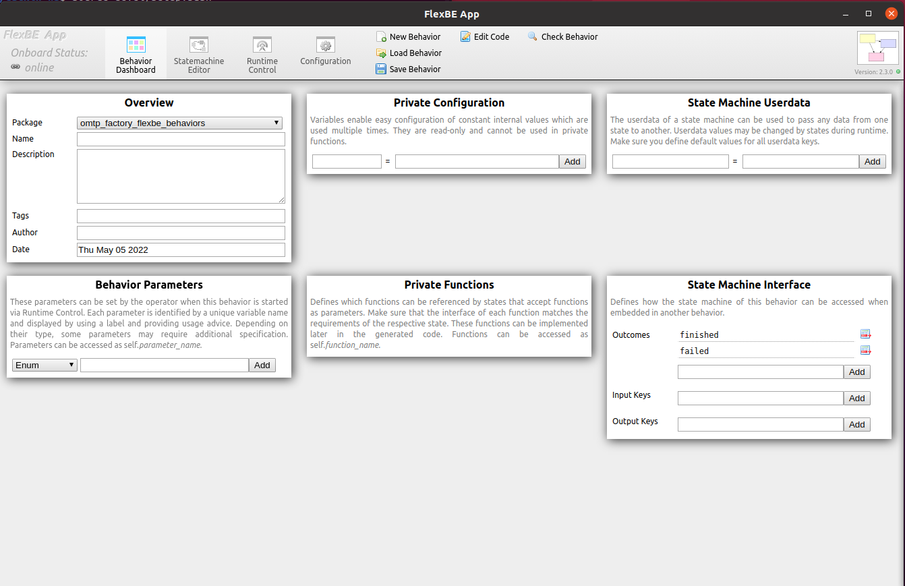
</p>

The above picture shows the FlexBE app interface. 
In overview the definition information of the behavior package is defined.
In private configuration joints and configuration of the robot arm is defined.
In state machine userdata information to be passed between states is defined.  

<p class="aligncenter">
    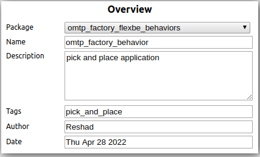
</p>
<p class="aligncenter">
    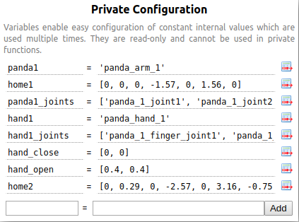
</p>
<p class="aligncenter">
    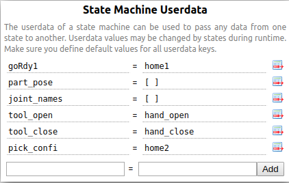
</p>

In the statemachine editor new states can be made and each state have their information that needs to be filled out.
The picture below shows the camera and grasp state information filled out. 

<p class="aligncenter">
    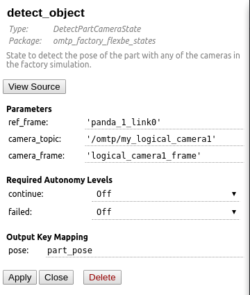
</p>
<p class="aligncenter">
    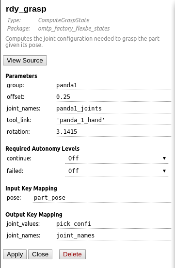
</p>

Aditionally States can be connected to different outcomes such as another state after completion, finshed node after completion and failur node otherwise.
A complete pick and place pipline is shown in the picture below.

<p class="aligncenter">
    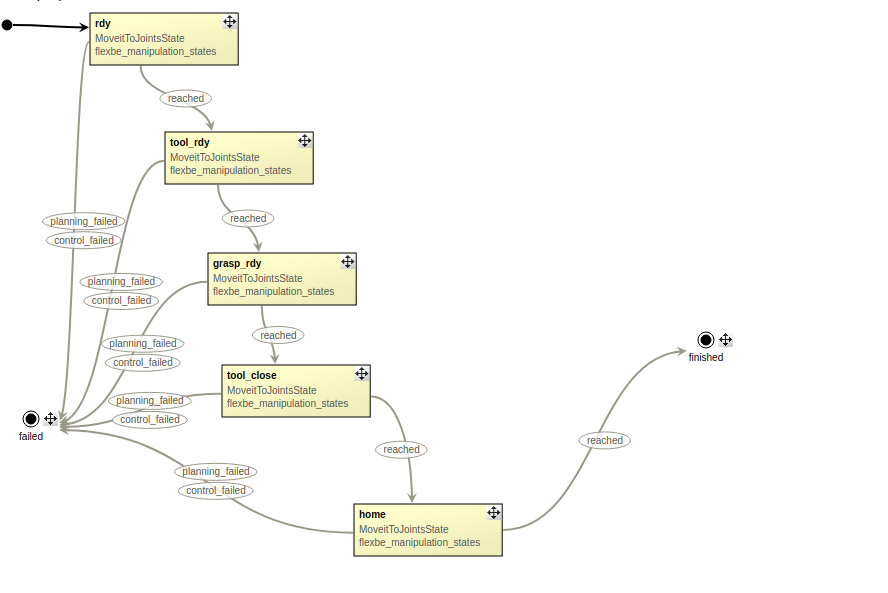
</p>

In the Runtime control the behavior can be excuted when the simulation in gazebo is running and in the configuration tab packages can be forced to be found if it does not get detected by FlexBE.

#### 2) Franka hand

A custom FlexBE state for the Franka hand is found in `src/lecture4_files/omtp_factory_behaviors/omtp_factory_flexbe_states`. The moveit to joint state have been modified to fit the Franka hand by adding the joints of the Franka hand and joint config to it. Mimic have been removed due to unexpected behavior thus both finger joints needs to be included.

#### 3) Error handling

## Lecture 5: Advanced Topic 1 - CNNs in Practical Robotic Applications

  Task list for lecture 5:
1. Intagrate Google Colab on own computer
2. Intagate YOLOv3 in the OMTP factory

#### 1) Google Colab intagration

The first step in intagrating Colab face detector on own computer is to download the zip given in the lecture. 
Next step is to upload the contents of the zip file into a folder in Google drive. The folder must be named covid19. Afterwards Google Colab app needs to be installed wich allows us to open covid19_mask.ipynb file in Google Colab. After that everyting in the covid19_mask.ipynb file can be executed and the face detector will detect.

<p class="aligncenter">
    
</p>

#### 2) YOLOv3 intagration

To start out with Anaconda have to be installed. Anacondas installation guide is found at `https://docs.anaconda.com/anaconda/install/linux/`. Next is to download the course files from lecture 5 and unloaded it the workspace. With that completed Anaconda enviroment can be setup with the following commands:

`$ conda create --name omtp_py27 python=2.7`
`$ conda activate omtp_py27`

Now the current terminal is in the omtp_py27 enviroment and ROS packages among stuff needs to be added to it, which is done with the following commands:

`$ conda install -c conda-forge ros-rospy `
`$ cd yolov3_pytorch_ros`
`$ pip install –r requirements.txt`
`$ cd models`
`$ sh download_weights.sh`
`$ cd ..`
`$ cd src`
`$ conda deactivate`
`$ conda deactivate`
`$chmod +x detector.py`
`$ cd`
`$ cd omtp_course_ws`
`$ catkin build`

With that the last step is to open 2 terminals and use the following commands:

##### Terminal 1

`$ conda deactivate`
`$ conda deactivate`
`$ roslaunch omtp_lecture8 omtp_panda_2d_cam.launch`

##### Terminal 2

`$ conda activate omtp_py27`
`$ roslaunch yolov3_pytorch_ros detector.launch`
#### 3) Error handling

 
## Lecture 7: Guest Lecture - Robots in Contact - From Task Demonstration to Execution in Contact - Part 1

In order to run the follownig codes, ensure that matlab is installed on the machine, with the "ROS Toolbox" and "Robotics System Toolbox" added as well.

1) The aim of the first exercise is to implement and test DMPs. Therefore:

* Download the omtp_LbD_lecture.zip folder and extract the folder
* In the folder under DMP_lib/Test_CDMP.m open the file.
* The file acts as a blueprint in which some of the equation and definitions are missing.
* Add the equations and definitions and replicate the recorded trajectory with the DMP in
position (DMP), Orientation (QDMP) and Joint (JDMP) space.

The zip folder was downloaded and the matlab file "Test_CDMP.m" was opened and edited. Following changes were made to the code.

At line 15: A function was made in order to calculate the joint trajectories. Requiring the DMP parameters from the xx file as input, and it would give the Joint DMP parameters as output. The function was made as a seperate file, similarly to the QDMP function. The function starts out by setting the DMP parameters, and then inserting them into the DMP_rlearn function, using the path and the current DMP parameters as input.

The DMP_rlearn.m file were edited to include following variables and formulas. The initial and goal state of the DMP was added. Then a formular to derive the trajectory was made in order to obtain the velocity, and was divided with the sampling rate to get xx. Those results were then dirived again to obtain the acceleration, which was also divided with the sampling rate. The next addition was a function to calculate the weighted sum of the locally weighted regression models, in order to xx. Next was a temporal scaling derivative which was divided with the torgue, in order to xx. Lastly for the function file, a second order DMP equation was added in order to fit the target to the DMP line. It was done by xx. 

Back to the Test_CDMP.m file, an intergration was done, similarly to the position part of the DMP, in order to get the joint positions.

Next, the DMP was plotted into three different figures, one displaying position, another velocity, and the last displaying acceleration over the trajectory obtained from the test_trj.mat file.

Lastly, in order to prevent MATLAB from crashing when running the code, Preallocation had to be done to the three variables: xN, jN and qQ.

After the formulas and variables were added, the following figures were displayed when running the code in Matlab:

<p class="aligncenter">
    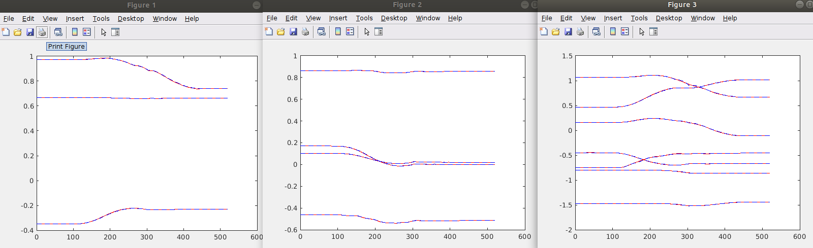
</p>

* Try to change the time and goal constants and comment the results.

2) The aim of the second exercise is to encode the demonstrated motion (test_trj.mat)
with DMPs and execute them in simulation.

* Start with MoveDMP_Gazebo.m file and add your code,

In the matlab file, the LearnJDMP and DMP_integrate function were added.

* from the command line launch the following roslaunch panda_moveit_config omtp_dmp.launch,

The command line were run in the terminal, and would create a gazebo world, containing one panda arm

* connect MATLAB to ROS (use rosinit to establish the connection),

rosinit was run in order to establish the connection between MATLAB and ROS

* run the simulation and Matlab code


Lecture 8: Guest Lecture - Robots in Contact - From Task Demonstration to Execution in Contact - Part 2
Exercise 1:
Setup for exercise 1 is similar to other OMTP projects. First you need to open gazebo for simulation to function.
First you need to build your environment with >catkin b then you source your files with >source devel\setup.bash and finally
you run >roslaunch omtp_lecture8 omtp_force.launch .This will show gazebo model of panda arm robot with box in front
of it. When you open matlab with test_move_grasp.m and run it, simulated model will start moving in accordance with movemnt
files in matlab. Unfortunately second exercise does not run on Melodic release of ROS, because of 
error message >Failed to load plugin libgazebo_ros_ft_sensor.so. To run own DMP controlled simulation run MoveDMP_gazebo.m.
you will have to restart gazebo before using matlab again, unfortunately. footnote:
Gazebo runs without errors on Noetic ROS systems, did not test further.

Exercise 2:
CCmoveForM.mat function is not found in files so second exercise could not be finished. 
There is one in older OMTP course, but does not seem to function correctly.

----
