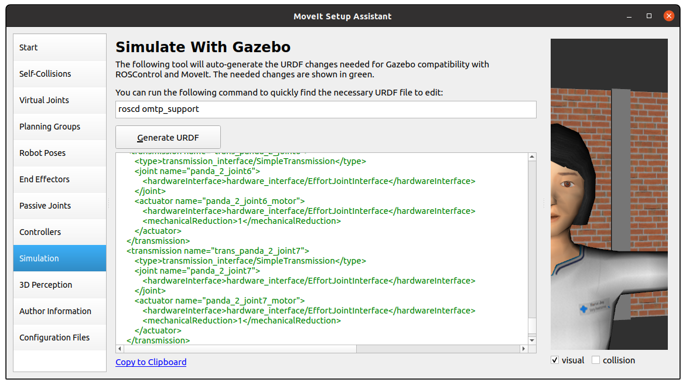

# OMTP

This repository contains solutions for the Object Manipulation and Task Planning course (8th semester, MSc. in Robotics 2022). Each lecture's solution is detailed in its corresponding section, including installation instructions, code usage, and error handling. Tags like lec<number>_submission indicate submissions for each lecture.

## Prerequisites

### ROS and Gazebo
Tested versions:
- Ubuntu 20.04
- [ROS Noetic](https://wiki.ros.org/noetic/Installation) & [Gazebo 11](http://gazebosim.org/tutorials/?tut=ros_wrapper_versions)

## Lecture 1 - Building a Robot Simulation Environment in ROS

Tasks:
1. Complete two URDF tutorials
2. Complete a XACRO tutorial
3. Inspect and rebuild the OMTP factory world (AAU Smart Lab)

URDF/Xacro tutorials:
- [Building a Visual Robot Model](http://wiki.ros.org/urdf/Tutorials/Building%20a%20Visual%20Robot%20Model%20with%20URDF%20from%20Scratch)
- [Building a Movable Robot Model](http://wiki.ros.org/urdf/Tutorials/Building%20a%20Movable%20Robot%20Model%20with%20URDF)
- [Using Xacro to Clean Up URDF](http://wiki.ros.org/urdf/Tutorials/Using%20Xacro%20to%20Clean%20Up%20a%20URDF%20File)

### Getting Started:
1. Create a catkin workspace: [Catkin Workspace Tutorial](http://wiki.ros.org/catkin/Tutorials/create_a_workspace)
2. Clone the repo: `git clone https://github.com/ROB8-very-N0ICE/OMTP.git`
3. Build the workspace: `catkin_make`
4. Install dependencies:
  - [ros_controllers](http://wiki.ros.org/ros_controllers)
  - [gazebo_ros_pkgs](http://wiki.ros.org/gazebo_ros_pkgs)
  - [gazebo_plugins](http://wiki.ros.org/gazebo_plugins)
  - [joint_state_publisher](http://wiki.ros.org/joint_state_publisher)
  - [joint_state_publisher_gui](http://wiki.ros.org/joint_state_publisher_gui)
  - [robot_state_publisher](http://wiki.ros.org/robot_state_publisher)

### Visualize the Factory:
- Run: `roslaunch omtp_support visualize_omtp_factory.launch`
  
  

    
  

- Inspect the factory by transforming Xacro to URDF: `xacro omtp_factory.xacro > omtp.urdf`
- Check URDF syntax: `check_urdf omtp.urdf`
- Generate a link graph: `urdf_to_graphiz`

### Rebuild the OMTP Factory:
Includes two Franka robots, bins, AAU Smart Lab modules, and other objects (e.g., conveyors, pallets). Additional models:
- [Ignition Models](https://app.ignitionrobotics.org/fuel/models)
- [Gazebo Models](https://github.com/osrf/gazebo_models)

### Running the Factory:
- Launch: `roslaunch omtp_support visualize_omtp_factory.launch`

  

    
  

## Lecture 2 - Manipulation with MoveIt

Tasks:
1. Create a MoveIt configuration package
2. Test MoveIt with the Commander tool
3. Create a custom Gazebo launch file and world
4. Implement a pick-and-place pipeline in Python

### MoveIt Setup:
- Run the MoveIt Setup Assistant: `rosrun moveit_setup_assistant moveit_setup_assistant`
  
  

    
  

- After generating the configuration, update URDF for Gazebo.

  

    
  

### Running the Pick-and-Place Pipeline:
- Python scripts: `lecture5_pick_and_place.py`

## Lecture 3 - Object Detection and Grasping

Tasks:
1. Add cameras to the world file
2. Visualize the TF tree
3. Integrate camera detection in the pipeline

### Adding Cameras:
- Example code for adding cameras to Gazebo world.

### TF Tree Visualization:
- Use `tf2_tools` to view updated TF tree.

  

    
  

  

    
  

## Lecture 4 - Behavior Design with FlexBE

Tasks:
1. Design a pick-and-place pipeline using FlexBE state machines
2. Create a custom FlexBE state for Franka Hand control

### FlexBE Installation:
1. Clone and install FlexBE repositories.
2. Launch FlexBE: `roslaunch flexbe_app flexbe_full.launch`

  

    
  

  

    
  

  
  

    
  

  

    
  

  

    
  

  
  

    
  

  

    
  

## Lecture 5 - Advanced Topic: CNNs in Robotics

Tasks:
1. Integrate Google Colab
2. Implement YOLOv3 in the OMTP factory

### YOLOv3 Setup:
- Instructions for setting up the Python environment and running YOLOv3 with ROS.

  

    
  

## Lecture 7 & 8 - Robots in Contact (Guest Lectures)

Tasks involve integrating MATLAB with ROS for motion planning using DMPs.

  

